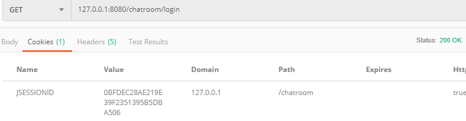
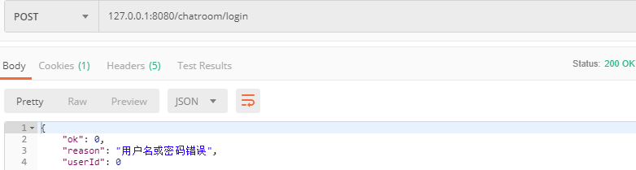

# 聊天室

## 项目背景

## 开发环境

+ 编程语言：Java
+ 开发平台：Win10
+ 开发工具：IDEA编译器、Tomcat 服务器、MySQL数据库

## 技术栈

+ 数据库设计：使用 MySQL 数据库，JDBC 操作 DataSource，双重校验锁解决数据一致性问题

+ 前端：基于 Ajax、JSON 的数据请求和解析

+ 后端：使用 Servlet 处理 HTTP 、websocket 请求；Gson库完成Java 对象和 JSON 数据之间的转换

  
  
  websocket 实现消息推送机制
  
  其实 HTTP 也可以实现消息推送，但是效率比较低，他具体实现的方式是：
  
  + 轮询：伪消息推送，按一定的周期主动访问服务器查看是否有新消息，大量轮询，但不是每次都有结构（短链接，每次处理完，连接关闭）
  + 长轮询：和轮询类似，也是定时去服务器发送请求，只是使用长连接形式和服务器建立连接。(每次请求处理完后连接保持下次在使用)
  
  生产者消费者模型完成消息转发

## 项目描述

M model 和数据管理密切相关

V view 和界面显示密切相关

C controller 核心业务逻辑

基于 MVC 设计模式实现的网页版的聊天室，在聊天室中可以关注一些现有频道，或者新建、删除频道。每个频道有一些具体的用户，任意用户在某频道中发言，该频道其他用户都能看到消息。支持用户登录、注册和群聊

网站的登录状态识别功能一般都是基于 cookie - session 机制实现的

当浏览器中登录一个账户后，再打开新的标签页，会看到，还是以刚才用户身份登录的

如何让多个账户同时登录？（存两份不同的 cookie就行）

可以拿两种浏览器实现；或者借助浏览器的无痕模式，不会重用原有的 cookie

## 详细设计

+ 分析需求
+ 数据库设计、确定表结构
+ 实现数据库操作
+ 设计前后端交互接口
+ 实现客户端、服务器端操作逻辑

#### 分析需求

+ 用户注册
+ 用户登录
+ 用户看到频道列表
+ 用户点击频道列表进入消息发送界面
+ 在消息发送界面可以发送消息也可以看到其他人的消息
+ 历史消息，用户可以看到上次退出到这次登录之间的所有消息

#### 数据库设计

实体：用户、频道、消息

用户和频道：默认任何用户都关注了所有频道，所以这两张表也没有太大关系

用户和消息：一对多，只考虑接收消息，把消息保存下来就是为了实现历史记录功能。发送消息不通过数据库完成，直接在内存代码中完成

频道和消息：按理是一对多，但是这个过程不需要数据库存，直接websocket 处理了，既然不涉及数据存储，也不需要设计实体关系

实体的关系还是要考虑需求


创建数据库：chatroom

用户表

+ userId                             primary key 
+ name                              unique  // 用户登录时名字
+ password 
+ nickName                      // 昵称，页面上显示的
+ lastLogout                     // 表示上次退出的时间. 用来实现历史记录功能


频道表

+ channelId                    primary keyimg
+ channelName       


消息表：实现消息历史记录

+ messageId                  primary key
+ userId
+ channelId
+ content                       
+ sendTimeimg


#### 前后端交互 API 设计

确定客户端能够给服务器发的请求，服务端的响应

restful 风格的 API 设计方式：

+ 不同的 HTTP 方法来表达不同的操作语义（POST、GET、DELETE、PUT）

+ 使用 path 路径表示 操作资源

+ 约定好格式，这里用 JSON格式 组织 body 数据


1. 用户注册

   ```
   POST /register
   {
   	name：xxx,
   	password：xxx,
   	nikName：xxx
   }
   
   
   HTTP/1.1 200 OK
   {
   	ok：1,			// 1 表示成功，0表示失败
   	reason：xxx		// 如果失败，reason 就是一个具体的失败原因
   }
   ```

   

2. 登录

   ```
   POST /login
   {
   	name:xxx,
   	password:xxx
   }
   
   
   HTTP/1.1 200 OK
   {
   	ok：1，
   	reason：xxx，
   	// 为了前端实现方便，可以加下面几个字段
   	userId：1，
   	name：xxx，
   	nickName：xxxx
   }
   ```

3. 检测登录状态

   ```
   GET /login
   Cookie：JSESSIONID = xxxxxx
   
   
   HTTP/1.1 200 OK
   {
   	ok：1，	       // ok 为 1，表示当前已登录，为 0 表示未登录
   	reason：xxx,
   	userId：1，
   	name：xxx,
   	nickName：xxxx
   }
   ```

4. 新增频道

   ```
   POST /channel
   
   {
   	channelName：xxx
   }
   
   
   HTTP/1.1 200 OK
   
   {
   	ok：1，
   	reason：xxxx
   }
   
   ```

5. 获取频道列表

   ```
   GET /channel
   
   
   HTTP/1.1 200 OK
   [
   	{
   		channelId: 1,
   		channelName:"xxxx"
   	},
   	
   	{
   		channelId: 2,
   		channelName:"xxxx"
   	}
   	
   ]
   
   ```

6. 删除频道

   ```
   DELETE /channel？channelId = 1
   
   
   HTTP/1.1 200 OK
   
   {
   	ok：1，
   	reason：“xxxx”
   }
   ```

7. 建立 websocket 连接 （传输消息的准备工作）

   ws://[ip]:[port]/message/{userId}

   ws:// 这样的 url 发送一个 HTTP 请求，请求中的 Upgrade 字段请求协议升级，服务端同意则响应 101 状态码

   每个登录中的用户，都需要有自己的连接，把连接之间使用 userId 来区分

8. 发送/接收消息格式

   把发送和接收格式做一个统一 

   JSON，当前这个 message 通过 websocket 传输

   ```
   {
   	usrId：1，		// 消息谁发的
   	nikName：xxx 	// 消息发送者昵称
   	channelId：1		// 消息要往哪里发
   	content：“xxx”	// 消息内容
   }
   ```

## 编码阶段

#### 数据库操作

**创建 DBUtil 类管理数据库连接**

+ 使用 DataSource 作为数据库连接的创建方式
+ 设计释放 JDBC 资源的方法

**创建数据库对应实体类,表示数据库中的某条记录**

+ User 类
+ Message 类
+ Channel 类

**封装数据库操作，具体的操作取决于需求和表结构**

+ UserDao：用户注册、登录和查找
  + 新增用户：注册
  + 查找用户信息：登录
  + 按用户 id 查找用户信息（把 userId 转换成昵称的时）
  + 更新用户的 lastLogout 时间，用户下线时更新，为了实现历史记录
+ ChannelDao：围绕频道的就是添加、删除和查看
  + 新增频道
  + 删除频道
  + 查看频道列表

+ MessageDao：把发送的消息保存，实现历史下拍戏功能，用户上次下线时间到下次上线时间间隔内消息全部显示
  + 新增消息
  + 按时间段查询消息

#### 完成单元测试

利用 Junit 框架 测试封装数据库的操作


1. 用户操作

+ UserDaoTest 
  + 注册：测试添加用户信息能否成功
  + 登录：测试根据用户名查找(unque)控制台打印信息
  + 测试按 userId 查找用户信息(把 userId 转换成 昵称 的时候)
  + 测试更新用户的退出时间
  
  ```
  package test;
  
  import model.User;
  import model.UserDao;
  import org.junit.Test;
  
  public class UserDaoTest {
  
      @org.junit.Test
      public void add() {
          UserDao userDao = new UserDao();
        
          // 测试添加新用户
          User user = new User();
          user.setName("the shy");
          user.setPassword("the shy");
          user.setNickName("迈特晒");
          userDao.add(user);
  		// 测试重复添加用户
          User user2 = new User();
          user2.setName("the shy");
          user2.setPassword("the shy");
          user2.setNickName("迈特晒");
          userDao.add(user2);
      }
  
      @Test
      public void selectByName() {
      	// 测试按用户名查找用户
          UserDao userDao = new UserDao();
          User user = userDao.selectByName("Irena");
          System.out.println(user);
      }
  
      @org.junit.Test
      public void selectById() {
      	// 测试按用户 id 查找
          UserDao userDao = new UserDao();
          User user = userDao.selectById(1);
          System.out.println(user);
      }
  
      @org.junit.Test
      public void updateLogout() {
      	// 测试能否更新用户的退出时间
          UserDao userDao = new UserDao();
          userDao.updateLogout(1);
      }
  }
  ```
  

2. 频道操作

+ ChannelDaoTest
  + 按照名字添加频道（为什么重复添加时只有最后一个能重复添加进去）
  + 按照 id 删除频道
  + 查找所有频道

  ```
  package test;
  
  import model.Channel;
  import model.ChannelDao;
  import org.junit.Test;
  
  import java.util.List;
  
  public class ChannelDaoTest {
  
      @Test
      public void add() {
      	// 测试添加新频道
          ChannelDao channelDao = new ChannelDao();
          
          Channel channel = new Channel();
          //channel.setChannelName("赛事预告");
          channel.setChannelName("电竞风云");
          channel.setChannelName("体坛快讯");
          //channel.setChannelName("一周八卦");
          channelDao.add(channel);
          // 在 id = 1 的位置已经插入后，再在前面添加是没法添加的，
          // 并且只有最后一个会被重复插入？
      }
  
      @Test
      public void delete() {
      	// 测试按频道序号删除频道
          ChannelDao channelDao = new ChannelDao();
  
          channelDao.delete(2);
      }
  
      @Test
      public void selectAll() {
      	// 测试查找全部频道
          ChannelDao channelDao = new ChannelDao();
  
          List<Channel> channels = channelDao.selectAll();
          System.out.println(channels);
      }
  }
  ```
  

3. 消息管理

+ MessageDaoTest
  + 测试新增消息
  + 测试查询历史记录功能
  
  ```
  package test;
  
  import model.Message;
  import model.MessageDao;
  import org.junit.Test;
  
  import java.sql.Timestamp;
  import java.util.List;
  
  public class MessageDaoTest {
  
      @Test
      public void add() {
      	// 测试新增消息
          MessageDao messageDao = new MessageDao();
  
          Message message = new Message();
          message.setUserId(1);
          message.setChannelId(1);
          message.setContent("冒泡赛");
          message.setSendTime(new Timestamp(System.currentTimeMillis()));
  
          messageDao.add(message);
      }
  
      @Test
      public void selectByTimeStamp() {
      	// 测试查询历史记录功能
      	
          // from to 都用时间戳表示的
          // 注意时间戳的范围已经超过了 int 所以加 L 表示 long
          MessageDao messageDao = new MessageDao();
          List<Message> messages = messageDao.selectByTimeStamp(
              new Timestamp(1598583183),new Timestamp(1598586783L)
          );
          System.out.println(messages);
      }
  }
  ```
  


#### 完成服务端接口并测试

使用 Gson 第三方类库完成 Java 对象和 JSON 数据之间的映射，即 JSON 字符串和 一个 Java 对象的相互转化

使用 Postman 工具模拟客户端请求测试各个接口是否正常可用


###### 用户操作接口

新用户注册请求


响应


重复注册


登录


响应


检测登录状态





不存在用户登录


响应



输入错误的密码登录


响应


输入错误的用户名登录


响应


###### 频道操作接口

查询所有频道操作：前置条件是登录


按照 channelId 删除存在的频道


响应结果


删除不存在的频道


响应


###### 消息转发

转发/消息群发如何实现？

1. 创建一个数据结构，保存服务器收到的消息，这是后续能转发的基础。（采用阻塞式队列）
   + 服务器接收到的消息会放入这个阻塞式队列--**生产者**
   + 启动一个线程扫描队列，并把消息转发给客户端--**消费者**
     + 其实在 onMessage 方法中，收到消息立刻遍历在线用户列表在针对消息数目比较少的情况下也是可以的
     + 如果短时间大量消息，服务器可能就会被这样的请求峰值给打垮，因为每次转发都是一个耗时开销，onMessage 周转速率变慢导致处理不过来
     + 引入消息队列就相当于一个缓冲区
2. 创建一个数据结构，保存在线用户列表，转发的时候需要转发给所有用户（采用一个 hash表保存，key 对应userId，value 对应 Session 对象，这个session是websocket 中的 session）

详细设计：

+ 创建一个作为单例的 MessageCenter，管理消息和用户列表
  + 保存消息队列 LinkedBlockingQueue
  + 保存在线用户列表 ConcurrentHashMap（线程安全，轻量级锁机制）
    + 用户上线
    + 用户下线
    + 新增消息
    + 创建线程一直扫描消息队列，把存的消息转发给所有在线用户


服务端：创建类，使用 ServerEndpoint 注解修饰，指定该类对应的 url 路径

+ onOpen：建立连接调用
+ onMessage：收到消息调用 (生产，扫描线程消费)
+ onError：连接异常调用
+ onClose：连接关闭调用

session.getBasicRemote().sendText 服务器给客户端发送消息的接口


客户端：创建 WebSocket 对象，同时指定连接服务器的 URL，给 WebSocket 对象注册一些方法

+ onopen：连接建立成功时调用
+ onmesage：收到消息时调用
+ onerror：连接异常时调用
+ onclose：连接关闭时调用

webSocket.send() 给服务器发送数据


如果不采用生产者消费者模型，在 onMessage 方法中，收到消息，立刻遍历在线用户列表，转发消息，其实也可以，但是有局限。

+ 如果消息数目少并无差
+ 如果消息数目多，短时间内，大量得到消息服务器可能就会被这样的请求峰值打卦，因为每次转发都是一个耗时开销。随着消息数目多、在线用户数目多，onMessage 方法周转速率就慢容易处理不过来
+ 引入一个额外的存储消息队列，相当于一个缓冲区


#### 客户端

实现一组网页，通过网页和服务器交互，找一个免费模板修改

通过 ajax 发送请求；基于Vue 前端框架实现页面的同步变化

主要实现的页面：

+ 登录
+ 获取频道列表
+ 接收消息并显示
+ 发送消息

## 小结

需要改进：

+ 是否可以该进实现私聊？
+ 目前数据库中 User 和 Channel 没有关系，即默认了任何一个用户关注看所有频道，其实不太合理，他们应该有一个多对多的关系实现，即实现用户关注/取消关注频道
+ 用于没有实现关注功能，所以消息的转发是给该频道的所有在线用户
+ 频道分页、分类展示
+ 搜索频道功能（数据库：Like；倒排索引？）

